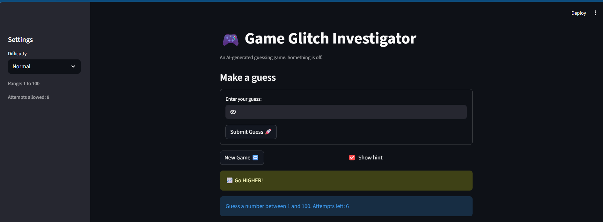
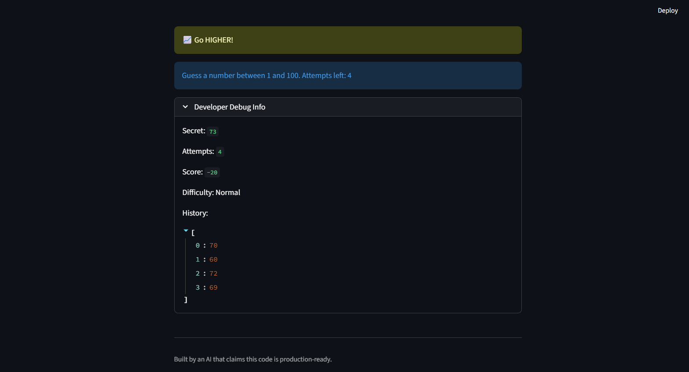
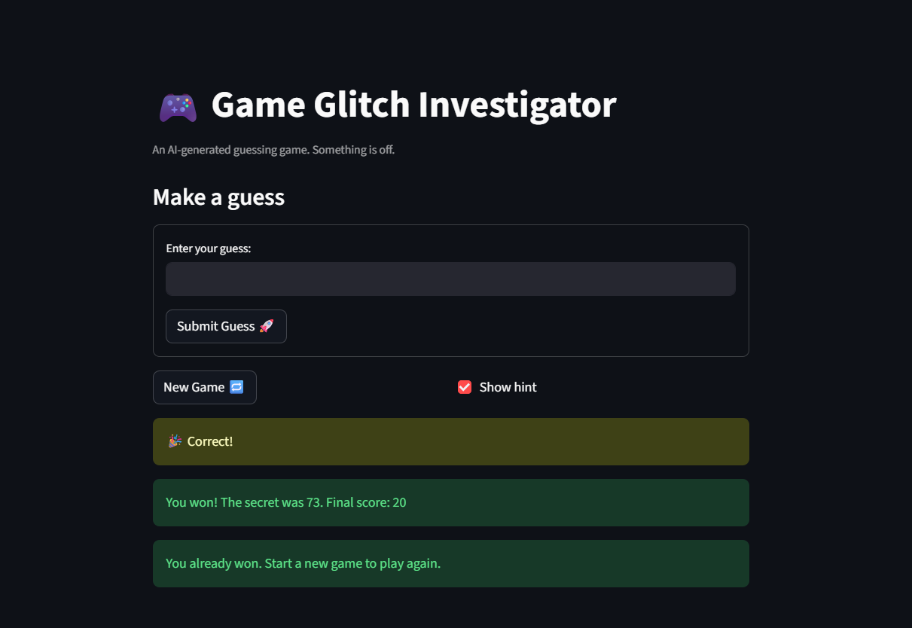
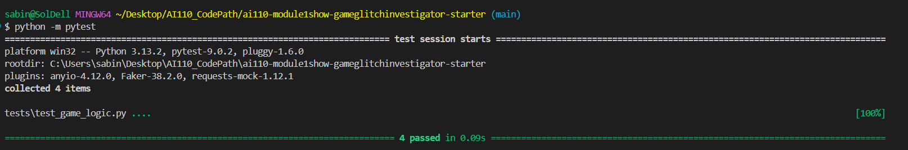

# 🎮 Game Glitch Investigator: The Impossible Guesser

## 🚨 The Situation

You asked an AI to build a simple "Number Guessing Game" using Streamlit.
It wrote the code, ran away, and now the game is unplayable. 

- You can't win.
- The hints lie to you.
- The secret number seems to have commitment issues.

## 🛠️ Setup

1. Install dependencies: `pip install -r requirements.txt`
2. Run the broken app: `python -m streamlit run app.py`

## 🕵️‍♂️ Your Mission

1. **Play the game.** Open the "Developer Debug Info" tab in the app to see the secret number. Try to win.
2. **Find the State Bug.** Why does the secret number change every time you click "Submit"? Ask ChatGPT: *"How do I keep a variable from resetting in Streamlit when I click a button?"*
3. **Fix the Logic.** The hints ("Higher/Lower") are wrong. Fix them.
4. **Refactor & Test.** - Move the logic into `logic_utils.py`.
   - Run `pytest` in your terminal.
   - Keep fixing until all tests pass!

## 📝 Document Your Experience

- [x] Describe the game's purpose.
The game is a Streamlit-based web application where players attempt to guess a randomly generated secret number within a specific range. Players have a limited number of attempts based on their chosen difficulty (Easy, Normal, Hard) and receive "higher" or "lower" hints after each guess to help them find the correct answer.
- [x] Detail which bugs you found.
   1. The Hint Bug: The logic was completely inverted, and the code intentionally triggered a TypeError by converting the secret to a string on even-numbered attempts. This caused the game to give mathematically incorrect advice (e.g., telling the user to "Go LOWER!" when their guess was already too low).
   2. Laggy UI: The Streamlit rendering cycle was out of order, and the text input wasn't batched properly. This meant users had to click "Submit" twice for the game state to visually update.
   3. The Broken "New Game" Button: Clicking "New Game" reset the secret number but failed to reset the status, score, or history arrays, leaving the game permanently stuck in a "Game Over" state with lingering old guesses.
   4. Hardcoded UI Text: The instruction text statically displayed "between 1 and 100", completely ignoring the dynamic ranges applied when the user changed the difficulty setting to Easy or Hard.
- [x] Explain what fixes you applied.
   1. Refactored the check_guess and other mathematical functions into logic_utils.py, removed the malicious string-conversion code, and corrected the "Too High/Too Low" string outputs.
   2. Wrapped the input field and submit button in an st.form to fix the double-click bug, and reordered the code so state updates process before the UI renders.
   3. Rewrote the if new_game: block to explicitly reset st.session_state.status = "playing", zero out the score, and clear the history array.
   4. Updated the st.info string to dynamically use the low and high variables so the displayed rules always match the selected difficulty.
   5. Updated the pytest suite in test_game_logic.py to correctly unpack the tuple returned by check_guess and verified that all tests passed.

## 📸 Demo

- [x] [, , ]
- [x] []

## 🚀 Stretch Features

- [ ] [If you choose to complete Challenge 4, insert a screenshot of your Enhanced Game UI here]
